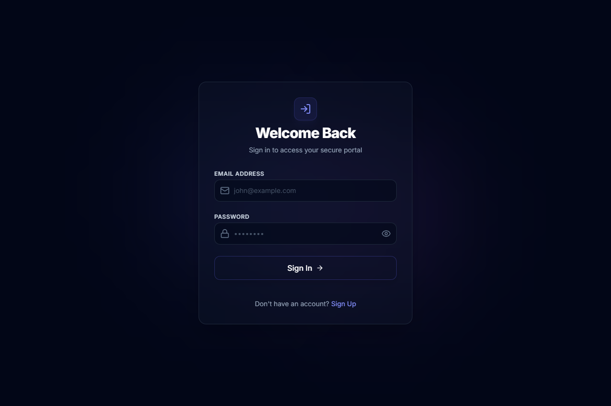
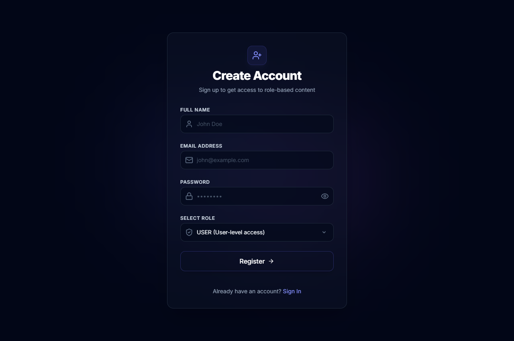
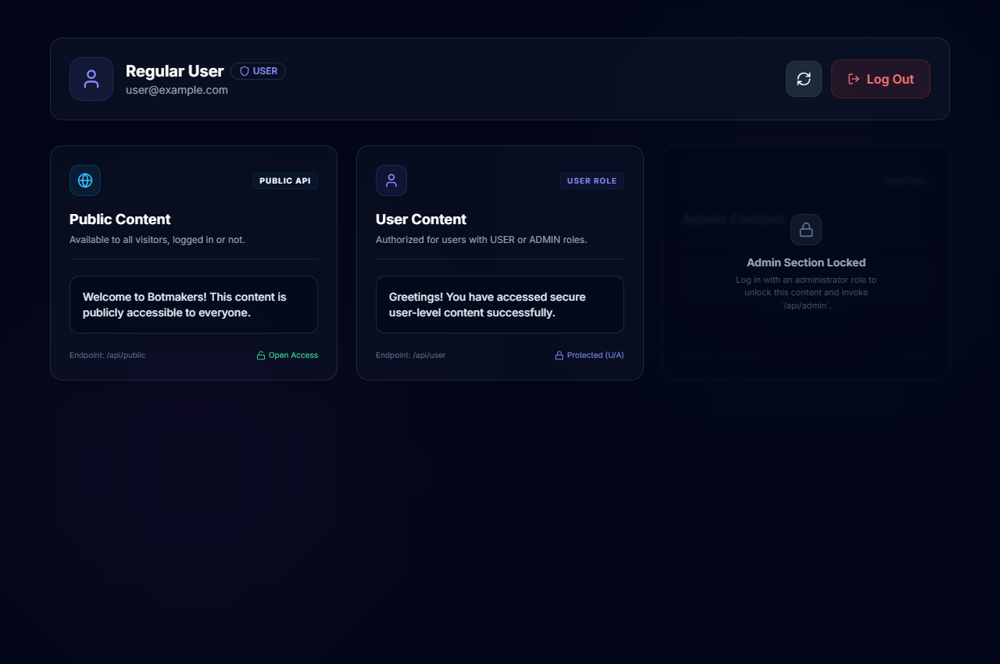
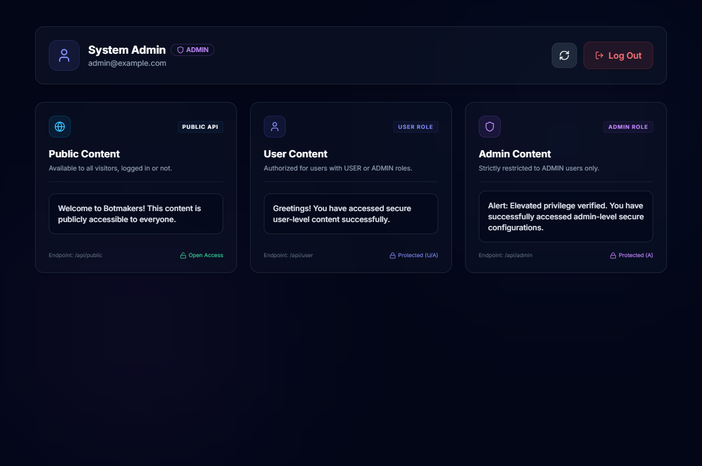

# Full-Stack Authentication & Role-Based Access Control (RBAC) System

This is a professional full-stack web application demonstrating secure authentication and Role-Based Access Control (RBAC) using a **Java 17 / Spring Boot** backend and a **React + TypeScript + TailwindCSS** frontend.

---

## 🚀 Features

* **JWT-Based Authentication**: Secure stateless authentication using JSON Web Tokens.
* **Role-Based Access Control (RBAC)**: Enforced endpoint access rules:
  * `/api/public` $\rightarrow$ Accessible to anyone (unauthenticated).
  * `/api/user` $\rightarrow$ Accessible to users with `USER` or `ADMIN` roles.
  * `/api/admin` $\rightarrow$ Restricted strictly to users with the `ADMIN` role.
* **Interactive Frontend Dashboard**: Dynamically renders card components containing resource data fetched from the API based on the user's role.
* **Validation & Security**:
  * Input validations on login/registration forms (email syntax, password complexity requirements).
  * JWT verification filters and secure API request interceptors.
* **H2 Database (In-Memory)**: Runs in-memory with automatic schema updates and data seed runner on startup.
* **Swagger/OpenAPI Documentation**: Automatically documents API endpoints with an interactive UI.

---

## 🛠️ Technology Stack

### Backend
* **Java 17** & **Spring Boot 3.3.x**
* **Spring Security** (Stateless filter chains & JWT validation)
* **Spring Data JPA & Hibernate** (Entity modeling and repository layers)
* **H2 Database** (Self-contained in-memory database)
* **MapStruct** (Compile-time type-safe Entity $\leftrightarrow$ DTO mappers)
* **Lombok** (Boilerplate code reduction)
* **Springdoc OpenAPI (Swagger)** (API Interactive UI docs)

### Frontend
* **React 18** & **TypeScript**
* **Vite** (Next-generation frontend tool)
* **TailwindCSS** (Custom responsive design styling)
* **React Router v6** (Client routing & navigation guards)
* **TanStack Query (React Query)** (Server-state caching, loading/error states)
* **Axios** (HTTP client with auth request interceptors)
* **React Hook Form** (Form state and validations)

---

## 🔑 Default Test Accounts

On application startup, the database is seeded with the following roles and default accounts for instant testing:

| Username (Email) | Password | Assigned Role | Description |
| :--- | :--- | :--- | :--- |
| **`admin@example.com`** | `Password123` | **`ADMIN`** | Full access to user and admin cards. |
| **`user@example.com`** | `Password123` | **`USER`** | Access to user card; admin card remains locked. |

---

## 📦 How to Run

### Prerequisite
* **Node.js** (v18 or higher recommended)
* **Java 17** (or you can run using standard environments)

---

### Step 1: Run the Backend (Spring Boot)

1. Open your terminal and navigate to the `backend/` directory:
   ```bash
   cd backend
   ```
2. Build and run the project using Maven:
   * **On Windows (PowerShell/CMD)**:
     ```powershell
     mvn clean spring-boot:run
     ```
   * **On macOS/Linux**:
     ```bash
     ./mvnw clean spring-boot:run
     ```
3. The server will start on port **`8080`**.
4. **API Documentation (Swagger UI)** will be accessible at: [http://localhost:8080/swagger-ui/index.html](http://localhost:8080/swagger-ui/index.html)
5. **H2 Database Console** will be accessible at: [http://localhost:8080/h2-console](http://localhost:8080/h2-console)
   * **JDBC URL**: `jdbc:h2:mem:authrbacdb`
   * **Username**: `sa`
   * **Password**: `password`

---

### Step 2: Run the Frontend (React + TypeScript)

1. Open a new terminal window and navigate to the `frontend/` directory:
   ```bash
   cd frontend
   ```
2. Install the node modules:
   ```bash
   npm install
   ```
3. Start the Vite development server:
   ```bash
   npm run dev
   ```
4. Open your browser and navigate to the local host address displayed (typically [http://localhost:5173](http://localhost:5173)).

---

## 📁 Project Structure

```
botmakers/
│
├── backend/                             # Spring Boot Project
│   ├── src/main/java/com/botmakers/authrbac/
│   │   ├── config/                     # WebConfig, DataInitializer
│   │   ├── controller/                 # AuthController, ContentController
│   │   ├── dto/                        # Request/Response DTO classes
│   │   ├── entity/                     # User, Role, RoleName Enums
│   │   ├── mapper/                     # MapStruct UserMapper
│   │   ├── repository/                 # UserRepository, RoleRepository
│   │   ├── security/                   # SecurityConfig, JwtService, Filters
│   │   └── service/                    # UserService, CustomUserDetailsService
│   │
│   ├── src/main/resources/
│   │   └── application.properties       # H2 DB and JWT properties
│   └── pom.xml                          # Maven build file
│
├── frontend/                            # Vite React + TypeScript App
│   ├── src/
│   │   ├── components/                 # ProtectedRoute guard
│   │   ├── context/                    # AuthContext and login/logout logic
│   │   ├── pages/                      # Register, Login, Dashboard, Unauthorized pages
│   │   ├── services/                   # Axios API settings and interceptors
│   │   ├── App.tsx                     # React Router configurations
│   │   ├── index.css                   # Tailwind imports and default styles
│   │   └── main.tsx                    # Root renderer
│   │
│   ├── tailwind.config.js               # Tailwind styling settings
│   └── package.json                     # NPM packages
│
├── screenshots/                         # Live application screenshots (captured automatically)
│   ├── 1_Login_Page.png
│   ├── 2_Register_Page.png
│   ├── 3_Dashboard_User_Role.png
│   └── 4_Dashboard_Admin_Role.png
└── README.md                            # Documentation
```

---

## 📸 Screenshots

Below are the actual screenshots of the live running application, showcasing the sleek, custom-designed dark-mode interface:

### 1. Login Page


---

### 2. Register Page


---

### 3. User Dashboard View
*(Public and User content cards are accessible; the Admin content card remains blurred and locked)*


---

### 4. Admin Dashboard View
*(All sections are fully unlocked and retrieving live API data)*


